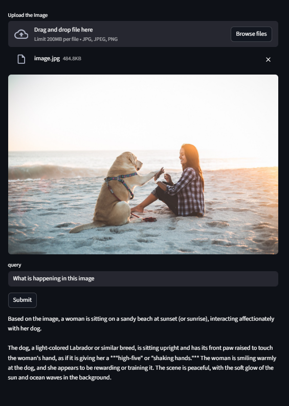

# Image-Analysis
A system to analyze image and use LLM to reason about it



## Environment Set-up
1. Create python environment
   ```code
   uv venv --python 3.12
   ```
2. Activate the environment
   ```code
   .venv\Scripts\activate # for windows

   source .venv/bin/activate # for mac and linux
   ```
3. Install the dependencies
   ```code
   uv pip install -r requirements.txt
   ```
4. Create the .env file
   ```code
   GEMINI_API_KEY=<your api key>
   ```

Once You have followed above steps to set-up the environment.
You can run the following command to start the Streamlit app.
```code
streamlit run main.py
```

## Description of Files

- ```src/meta_analysis.py```: This file initializes the CLIP model and the BLIP model, CLIP model is used for the image classification, you can also provide custom labels for the classification.<br>
  The BLIP model is used for image captioning.

- ```src/llm_analysis.py```: This file initializes the gemini client, and it takes user query, image bytes, image description, and the label as input to generate the final response.

- ```main.py```: This file contains the code for the Streamlit app.

- ```data/image.jpg```: An example image for testing.

- ```write-up.txt```: Contains the write-up of this project.